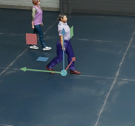

## AIM
This project is to simulate E2E Robot On issac-sim and collect the dataset

## Attention

1. 如图所示，人物朝前的方向和实际的坐标轴方向不一样，所以需要把得到的ego_pose和sample_annotation的rotation统一处理一下，这个情况下x轴朝左，所以旋转-90度顺时针到任务前面即可，就是让每一个ego_pose和sample_annotation的角度都加上-90

2. 局部坐标提取不对可能是can_bus的数据没能很好地体现局部方向和位移

3. isaac 要小心设置场景的时候class id一样, 可以用isaac的工具检查Bbox3d的颜色来看种类